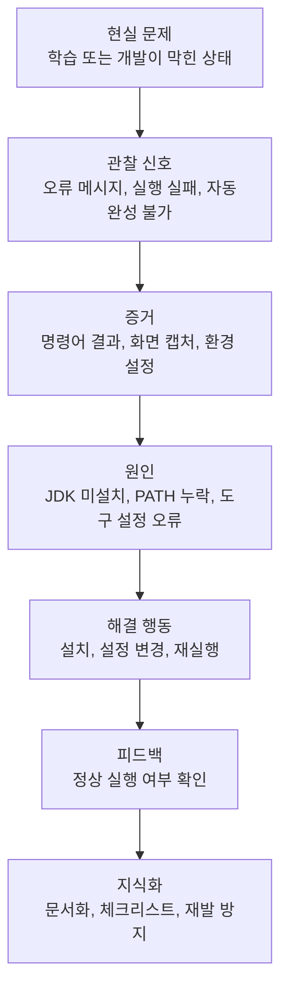

# Ontology Feedback

이 저장소는 개발 학습 중 발생한 현실 문제를 **온톨로지적으로 구조화**하고, 문제 해결 과정을 기록하기 위한 저장소입니다.

단순히 “오류가 났다”에서 끝내지 않고, 문제를 다음 흐름으로 정리합니다.

```text
현실 문제 발견
-> 증거 수집
-> 원인 진단
-> 기술적 해결
-> 피드백 보정
-> 재발 방지 지식화
```

## 저장소 목적

개발자는 코드만 보는 사람이 아니라, 코드가 실행되는 현실 환경까지 함께 읽어야 합니다.

이 저장소는 다음 역량을 기록하기 위해 만들었습니다.

- 문제 상황을 감정이 아닌 구조로 정리하는 능력
- 실행 환경, 도구 설정, 오류 메시지를 근거로 원인을 찾는 능력
- AI 도구를 활용해 진단 과정을 빠르게 좁히는 능력
- 발견한 문제를 해결 가능한 단위로 쪼개는 능력
- 해결 경험을 다음 학습과 개발에 재사용 가능한 지식으로 바꾸는 능력

## 핵심 온톨로지 모델



## 문서

- [현실 문제 해결 온톨로지](docs/PROBLEM_SOLVING_ONTOLOGY.md)
- [Problem-Solving Ontology English Version](docs/PROBLEM_SOLVING_ONTOLOGY_EN.md)
- [Java 환경 설정 문제 원본 학습 기록](docs/Application_Java_Setup_Error.md)

## 개인 메모

이 저장소는 개인 학습 과정에서 현실 문제가 어떻게 기술 문제로 연결되고, 다시 해결 가능한 지식으로 바뀌는지 기록하기 위한 공간입니다.

민감한 정황이 포함된 문서는 공개 범위를 신중하게 결정하는 것이 좋습니다.
