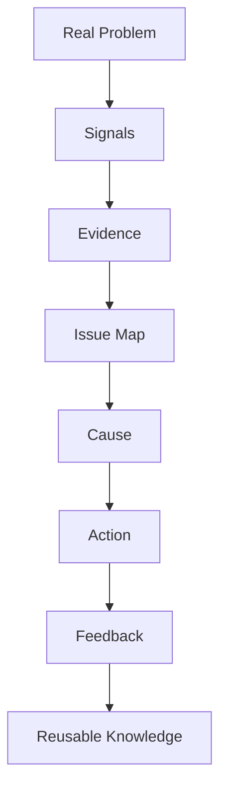

# Ontology Feedback

## Core Positioning

```text
Domain-driven AI Technical PM
for healthcare, legal, cybersecurity, and AI governance
```

I combine healthcare and legal domain experience with hands-on AI backend practice.
My focus is building safe, observable, and compliant AI systems for high-stakes domains.

```text
Medical background
+ Legal dispute structuring experience
+ Ontology-driven thinking
+ AI-native PM / backend orchestration
= Legal/Medical AI Technical PM
```

This is the core positioning of this repository.

I connect domain knowledge, legal and medical reasoning patterns, ontology-based structure, and AI-native backend architecture into practical AI system design.

This repository is a personal knowledge-structuring lab for turning complex real-world problems into reusable ontology, feedback loops, and AI system design patterns.

It is not just a collection of troubleshooting notes. It is a record of how I think: observing messy reality, extracting signals, organizing evidence, identifying causes, designing corrective actions, and converting the result into reusable knowledge.

## Positioning

I am an AI-native Technical PM with domain experience in medicine and legal workflows.

I have hands-on experience structuring multiple civil and criminal legal disputes, including related procedural and evidentiary workflows. Through this experience, I developed practical insight into legal document workflows, evidence organization, issue mapping, procedural timelines, and risk analysis.

After evaluating external legal support, I independently rebuilt the case structure, documentation strategy, and evidence-to-issue mapping process. This shaped my interest in Legal AI, ontology-driven reasoning, and safer domain-specific AI systems.

I focus on ontology-driven AI systems, especially Legal/Medical AI, safe RAG architecture, API contracts, guardrails, observability, and backend orchestration.

I am building toward Legal/Medical AI systems where ontology, safe RAG, guardrails, and backend orchestration help structure complex domain knowledge into reliable AI workflows.

## Why This Matters

Modern AI systems do not become useful only by connecting an LLM to a chat UI.

In high-stakes domains such as law and medicine, the harder problems are:

- defining the right concepts
- mapping evidence to issues
- separating facts, claims, risks, and decisions
- tracing where an answer came from
- preventing unsafe or unsupported responses
- turning domain workflows into reliable system behavior

That is why ontology matters.

For me, ontology is not an abstract academic word. It is a practical way to make complex work inspectable, repeatable, and safer.

```text
Messy reality
-> observable signals
-> evidence
-> issue mapping
-> cause analysis
-> corrective action
-> feedback
-> reusable knowledge
```

## Core Model



## Legal / Medical AI Direction

This repository is also a foundation for my long-term Legal/Medical AI direction.

The target is not a generic chatbot. The target is a domain-aware AI system that can structure specialized knowledge and workflows.

```text
Legal AI
-> legal documents
-> claims and defenses
-> evidence-to-issue mapping
-> procedural timelines
-> risk analysis
-> safer legal reasoning support
```

```text
Medical AI
-> clinical documents
-> symptoms and findings
-> diagnosis and treatment concepts
-> guideline-based reasoning
-> risk and safety boundaries
-> safer medical workflow support
```

## AI System Architecture Direction

The backend and AI architecture direction I am building toward:

```text
Client / User
-> REST API
-> Request DTO
-> Validation
-> Service Layer
-> Guardrails
-> RAG / Knowledge Graph
-> LLM
-> Evidence-based Response
-> ErrorResponse
-> Observability
-> Monitoring
```

Key technical interests:

- Spring Boot REST API contracts
- FastAPI AI servers
- safe RAG architecture
- NVIDIA NeMo Guardrails
- domain ontology and knowledge graphs
- API ErrorResponse design
- traceId and observability
- Actuator, metrics, Prometheus, and Grafana
- Java 21 Virtual Threads for waiting-heavy AI workloads

## Documents

- [현실 문제 해결 온톨로지](docs/PROBLEM_SOLVING_ONTOLOGY.md)
- [Problem-Solving Ontology English Version](docs/PROBLEM_SOLVING_ONTOLOGY_EN.md)
- [Legal Intake Readiness Draft](docs/LEGAL_INTAKE_READINESS_DRAFT.md)

## Legal Branch Draft Direction

The `legal` branch contains a first draft for legal intake readiness.

```text
Legal intake signal
-> case signal
-> readiness score
-> case readiness decision
-> recommended next step
-> intake history
```

This is not legal advice.
It is a draft structure for organizing legal intake before consultation.

The ontology is intentionally shallow for now.
Future work will expand the model into facts, claims, defenses, evidence, procedural timelines, deadlines, risks, and consultation readiness.

## Study And Portfolio Direction

This repository connects my learning process to my portfolio direction.

I use AI tools such as Codex and Claude not as copy-paste shortcuts, but as acceleration tools for implementation, review, documentation, and architectural comparison.

My focus is to understand and explain:

- what problem is being solved
- what concepts are involved
- how the process flows
- what evidence supports the decision
- where the risk is
- how the result can be reused
- how the structure can become part of an AI system

## One-Line Summary

I am building an ontology-driven AI Technical PM practice around Legal/Medical AI, safe RAG, guardrails, API contracts, observability, and backend orchestration.
