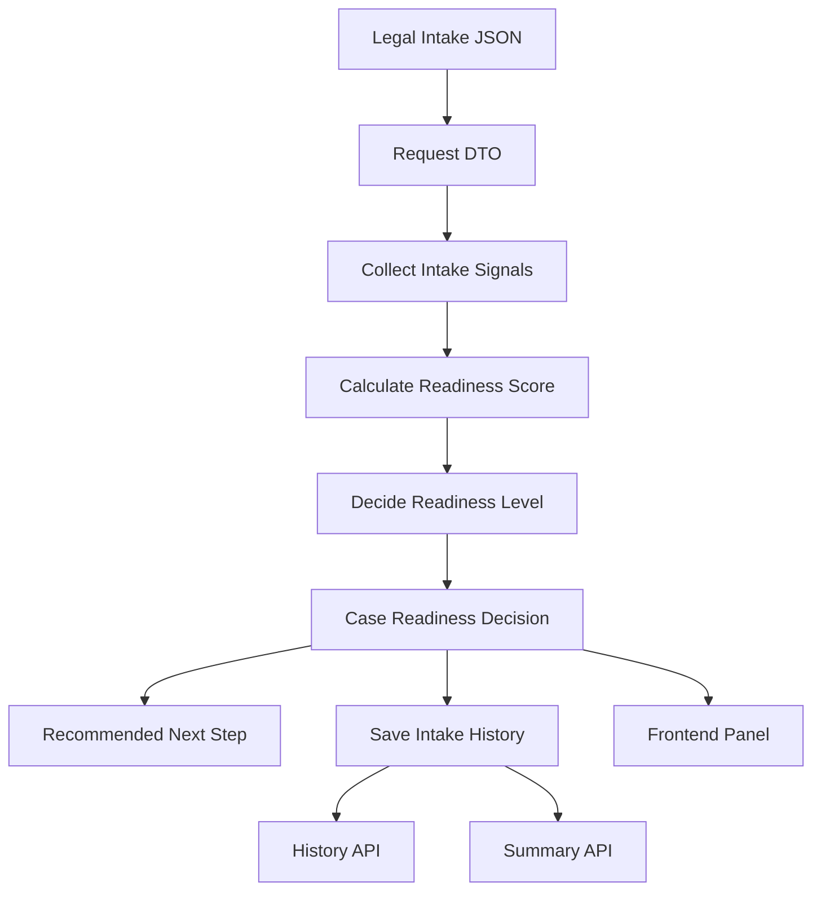

# Legal Intake Readiness Draft

This document is a draft extension of my ontology-driven AI system direction.

The goal is not to provide legal advice.
The goal is to structure legal intake information before consultation.

```text
Legal intake signal
-> case signal
-> readiness score
-> case readiness decision
-> recommended next step
-> intake history
```

This draft will be improved later with a deeper legal ontology.

---

## 1. Core Idea

The existing backend decision pattern can be reused.

```text
AI agent risk decision
-> legal case readiness decision
```

Existing AI agent risk architecture:

```text
agent behavior signal
-> risk score
-> risk decision
-> recommended action
-> history
```

Draft legal intake architecture:

```text
legal intake signal
-> readiness score
-> case readiness decision
-> recommended next step
-> intake history
```

The technical structure is almost the same.

```text
Controller
DTO
Service
Rule
Score
Decision
JPA History
Summary API
Frontend Panel
```

The main gap is not the backend structure.
The main gap is the domain ontology.

---

## 2. Draft Intake Signals

This first draft uses simple intake signals.

```text
case type
claim purpose
evidence exists
deadline or limitation issue
opponent known
damage amount known
current stage
urgency
```

These are not final legal ontology concepts.
They are starting points for an intake-readiness prototype.

---

## 3. Draft API Contract

Endpoint:

```http
POST /api/legal/intake/analyze
```

Request:

```json
{
  "caseType": "civil",
  "summary": "Contract deposit return dispute with transfer records and chat evidence.",
  "claimPurpose": "deposit return",
  "hasEvidence": true,
  "hasDeadline": true,
  "opponentKnown": true,
  "damageAmountKnown": false,
  "currentStage": "before_lawsuit",
  "urgent": false
}
```

Response:

```json
{
  "decision": "READY_WITH_MISSING_AMOUNT",
  "readinessScore": 80,
  "readinessLevel": "HIGH",
  "signals": [
    "CASE_TYPE_PROVIDED",
    "CLAIM_PROVIDED",
    "EVIDENCE_EXISTS",
    "DEADLINE_EXISTS",
    "OPPONENT_KNOWN",
    "STAGE_PROVIDED"
  ],
  "recommendedNextStep": "ORGANIZE_CLAIM_AMOUNT_AND_EVIDENCE_TIMELINE",
  "ontologyDraft": true,
  "historyId": 1,
  "traceId": "generated-trace-id"
}
```

History APIs:

```http
GET /api/legal/intake/history
GET /api/legal/intake/summary
```

---

## 4. Draft Decision Model

Example decision rules:

```text
missing basic facts
-> INCOMPLETE_INTAKE
-> COLLECT_BASIC_FACTS
```

```text
evidence exists + core facts exist
-> BASIC_REVIEW_READY
-> ORGANIZE_EVIDENCE_TIMELINE
```

```text
evidence exists + damage amount missing
-> READY_WITH_MISSING_AMOUNT
-> ORGANIZE_CLAIM_AMOUNT_AND_EVIDENCE_TIMELINE
```

```text
deadline exists + evidence missing
-> DEADLINE_FOCUSED_REVIEW
-> CHECK_DEADLINE_AND_LIMITATION_PERIOD
```

```text
urgent + deadline exists
-> URGENT_REVIEW_REQUIRED
-> ESCALATE_URGENT_REVIEW
```

```text
high readiness score
-> CONSULTATION_READY
-> PREPARE_LAWYER_CONSULTATION_PACKET
```

---

## 5. Flowchart



---

## 6. Future Ontology Expansion

This draft is intentionally shallow.

Later ontology work should separate:

```text
facts
claims
defenses
evidence
deadlines
procedural stage
parties
damages
risks
next actions
```

Future legal-domain ontology may include:

```text
case type hierarchy
claim element mapping
evidence-to-issue mapping
procedural timeline
deadline and limitation period model
risk and urgency model
consultation readiness checklist
document preparation checklist
```

The future system should not jump directly to legal answers.
It should first organize the intake structure.

```text
messy user story
-> structured facts
-> issue map
-> missing information
-> readiness decision
-> consultation packet
```

---

## 7. Portfolio Positioning

This draft is valuable because it connects:

```text
domain experience
-> ontology thinking
-> backend decision architecture
-> API contract
-> JPA history
-> frontend decision panel
```

Portfolio message:

```text
I am not only building a chatbot.
I am building a domain-aware decision architecture
that can organize high-stakes intake information before AI response generation.
```

Boundary:

```text
This is not legal advice.
This is a legal intake readiness and information-structuring prototype.
```

