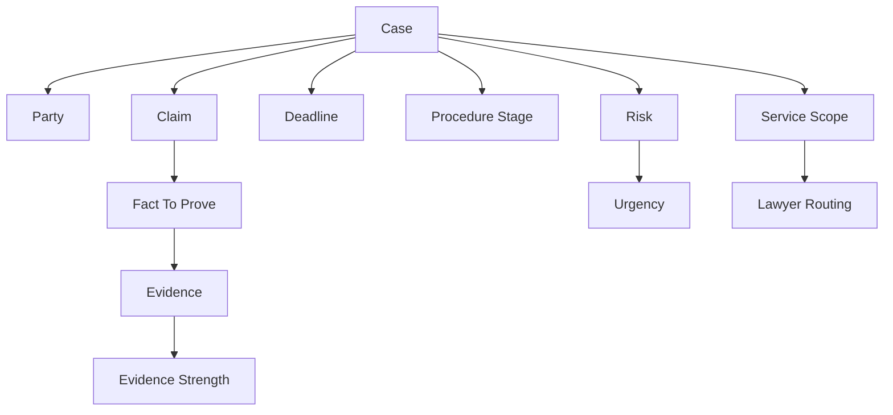

# Legal Ontology Brainstorming

This document is a brainstorming note for future legal ontology and product development.

It is based on direct user-side observation of legal consultation, intake, self-representation, evidence preparation, and AI-assisted case structuring.

The goal is not to criticize individual lawyers.
The goal is to identify a product opportunity:

```text
legal intake
-> evidence-to-issue mapping
-> case readiness
-> lawyer routing
-> AI-assisted self-representation support
```

Boundary:

```text
This is not legal advice.
This is a legal intake, evidence mapping, and workflow-structuring concept note.
```

---

## 1. Core Market Observation

Legal clients are no longer information-empty.

Many users now arrive after:

```text
search
YouTube
community reading
AI-assisted case structuring
electronic court experience
draft document preparation
```

But many law offices still operate with:

```text
phone-first intake
desk-level filtering
unstructured consultation
high upfront retainers
weak written output
Naver-focused marketing
limited digital workflow
```

This creates a gap between user expectation and legal service intake.

Product thesis:

```text
The legal market will not be changed only by AI answering legal questions.
It will be changed by AI restructuring intake, evidence mapping, document preparation, and client routing before formal representation begins.
```

---

## 2. Intake Is The First Bottleneck

The first bottleneck is often not legal reasoning itself.

The first bottleneck is intake:

```text
facts are not structured
evidence is not mapped
deadlines are not checked
the desired service scope is unclear
the user repeats the story many times
the lawyer receives weakly structured information
```

Existing pattern:

```text
phone call
-> rough filtering
-> paid consultation
-> user explains from the beginning
-> limited written output
-> full representation is suggested
```

Better pattern:

```text
structured intake
-> free-text story
-> AI summary
-> missing information questions
-> evidence checklist
-> readiness score
-> consultation packet
-> lawyer routing
```

Key point:

```text
The intake layer should not simply block low-value inquiries.
It should classify, structure, prioritize, and route potential clients.
```

---

## 3. Hybrid Intake: Checklist + Free Text + AI Summary

Legal intake cannot be fully checkbox-based.

Legal cases are narrative-heavy:

```text
events
dates
contracts
messages
money flow
relationships
procedural history
documents
opponent behavior
```

But pure free-text intake is also too unstructured.

The better structure is hybrid:

```text
minimum checklist
+ free-text narrative
+ AI summarization
+ missing information detection
+ readiness scoring
+ routing decision
```

Draft intake fields:

```text
case type
claim purpose
desired service scope
evidence exists
deadline exists
opponent known
damage amount known
current procedural stage
urgency
budget range
preferred support type
```

Free-text AI extraction should identify:

```text
parties
dates
amounts
events
documents
evidence
claims
risks
missing facts
next questions
```

---

## 4. Evidence Is More Important Than Wordy Argument

The core of case preparation is not persuasive language alone.

The stronger structure is:

```text
issue
-> fact to prove
-> evidence
-> explanation
-> procedural submission
```

Legal AI should not only generate long arguments.
It should map evidence to issues.

Evidence-to-issue mapping:

```text
issue: deposit return claim

facts to prove:
contract existed
money was transferred
return condition occurred
opponent failed to return

evidence:
contract
transfer record
chat messages
notice
recording

mapping:
transfer record -> proves payment
chat messages -> prove agreement and opponent statement
notice -> proves demand for return
```

Product implication:

```text
Legal AI should become an evidence map and case preparation system,
not only a legal answer generator.
```

---

## 5. Self-Represented But AI-Augmented Users

Some users do not primarily need full representation.

They need:

```text
case structuring
evidence organization
issue mapping
document drafting support
deadline checks
procedural checklists
limited expert review
```

User type:

```text
self-represented but AI-augmented legal user
```

This user may have:

```text
direct knowledge of the facts
direct ownership of evidence
AI-assisted drafts
court filing access
strong motivation
specific questions for limited expert review
```

This creates a middle layer between:

```text
full representation
```

and:

```text
doing everything alone without tools
```

New product layer:

```text
AI-assisted legal self-representation support
```

---

## 6. Market Segmentation Hypothesis

The legal market may become more polarized.

Segments likely to remain strong:

```text
high-skill specialists
specialized boutique firms
strong brands
complex litigation teams
high-stakes strategy advisors
```

Segments under pressure:

```text
high-fee but weak-output consultations
phone-first offices
unstructured intake
generic fear-based consultation scripts
slow document workflows
low digital maturity
AI-weaker explanations
```

Middle-layer opportunity:

```text
AI legal intake
evidence mapping
readiness scoring
limited-scope review
lawyer routing
consultation packet generation
```

Portfolio thesis:

```text
As AI reduces information asymmetry,
low-differentiation legal services with high fees but weak structured output will face pressure.
```

---

## 7. Legal Intake Triage Platform Idea

One possible product model:

```text
24/7 AI-assisted legal intake
-> 20-minute structured intake
-> case summary
-> evidence checklist
-> readiness score
-> lawyer routing
-> paid consultation connection
```

This should be described carefully:

```text
AI legal intake and consultation preparation platform
```

Not:

```text
AI legal advice replacement
```

Possible service flow:

```text
1. user starts AI intake
2. AI asks structured questions
3. user writes free-text story
4. AI extracts facts, dates, parties, evidence, claims
5. system creates readiness score
6. system identifies missing information
7. system generates consultation packet
8. user chooses paid consultation or document review
9. lawyer receives structured packet
10. consultation is more efficient
```

Possible routing:

```text
information-only inquiry -> guide content
simple document review -> limited-scope review
urgent/high-risk case -> priority lawyer review
complex/high-value case -> full representation candidate
self-representation case -> evidence map and checklist support
```

---

## 8. Service Scope Should Be Explicit

Many users do not want full representation first.

They may want:

```text
document review
document filing support
evidence organization
issue mapping
limited legal opinion
consultation preparation
court submission checklist
case strategy validation
```

The intake system should ask:

```text
What do you need?
```

Possible service scope ontology:

```text
FULL_REPRESENTATION
DOCUMENT_REVIEW
DOCUMENT_DRAFTING_SUPPORT
EVIDENCE_MAPPING
PROCEDURAL_GUIDE
LIMITED_EXPERT_REVIEW
CONSULTATION_PREPARATION
SELF_REPRESENTATION_SUPPORT
LAWYER_ROUTING
```

This matters because user needs are not binary:

```text
hire lawyer
vs
do everything alone
```

There is a large middle layer.

---

## 9. Future Legal Ontology Concepts

The legal ontology should eventually separate:

```text
Case
Party
Claim
Defense
Fact
Evidence
Issue
Deadline
Damage
ProcedureStage
Risk
Action
Document
ServiceScope
ReadinessDecision
```

Possible relationships:

```text
Case hasParty Party
Case hasClaim Claim
Claim requiresFact Fact
Fact supportedBy Evidence
Evidence proves Issue
Case hasDeadline Deadline
Case hasProcedureStage ProcedureStage
Case hasRisk Risk
Case needsAction Action
User requestsServiceScope ServiceScope
ReadinessDecision recommends Action
```

Draft graph:



---

## 10. Development Direction

Short-term prototype:

```text
Legal Intake Readiness API
Legal Intake History
Readiness Score
React Draft Panel
Legal Ontology Draft Document
```

Next project direction:

```text
Legal/admin knowledge graph
Case readiness graph API
Evidence-to-issue map
Missing information checklist
Consultation packet generator
```

AI chatbot project direction:

```text
Legal intake chatbot
SSE streaming UI
JWT login
chat history
intake history
readiness score
guardrail boundary
```

Python/FastAPI/NeMo direction:

```text
NeMo Guardrails input rail
legal advice boundary rail
Colang intake flow
Python ontology action
Spring history and metrics integration
```

LangChain/RAG direction:

```text
legal/admin document retrieval
evidence checklist retrieval
procedure guide retrieval
consultation packet grounding
LangSmith trace and evaluation
```

---

## 11. One-Line Thesis

```text
Legal service transformation will not come only from AI answering legal questions.
It will come from AI restructuring the intake, evidence mapping, document preparation, and lawyer routing workflow before formal representation begins.
```

Korean version:

```text
법률 서비스의 변화는 AI가 법률 질문에 답하는 것만으로 오지 않는다.
정식 수임 이전의 intake, 증거 매핑, 문서 준비, 변호사 연결 워크플로우가 AI로 재구조화되면서 온다.
```

