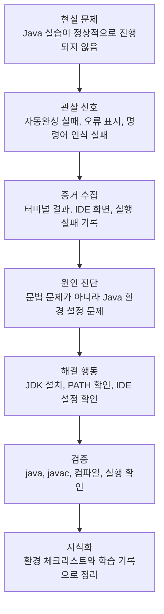

# 현실 문제 해결 온톨로지

이 문서는 Java 학습 중 발생한 실행 환경 문제를 바탕으로, 나의 현실 문제 해결 과정을 온톨로지 형태로 정리한 기록입니다.

핵심은 특정 사건 자체가 아니라, 문제를 어떻게 인식하고, 증거를 모으고, 원인을 찾아 해결 가능한 지식으로 바꾸었는지입니다.

---

## 1. 문제 상황

Java 수업과 실습을 진행하는 과정에서 코드 작성 자체보다 먼저 개발 환경 문제가 발생했습니다.

겉으로 보기에는 실습을 따라가지 못하는 문제처럼 보였지만, 실제 원인은 학습 태도나 이해 부족이 아니라 Java 실행 환경 설정 문제였습니다.

문제의 핵심은 다음과 같았습니다.

```text
Java 코드를 작성해야 함
-> IDE와 터미널이 Java 명령어를 제대로 인식하지 못함
-> 자동완성, 컴파일, 실행이 정상적으로 되지 않음
-> 실습 흐름이 계속 막힘
```

---

## 2. 관찰된 신호

문제를 단순한 감각이 아니라 관찰 가능한 신호로 나누었습니다.

```text
pvsm 자동완성이 정상적으로 작동하지 않음
System 관련 코드에 오류 표시가 발생함
터미널에서 java 또는 javac 명령어가 인식되지 않음
새로 만든 Java 파일에서도 기본 실행 환경이 안정적으로 잡히지 않음
```

이 신호들은 “코드를 모른다”는 문제가 아니라, “컴퓨터가 Java 개발 환경을 제대로 인식하지 못한다”는 방향을 가리켰습니다.

---

## 3. 증거 수집

문제 해결을 위해 감정적 판단보다 확인 가능한 증거를 우선했습니다.

확인한 증거는 다음과 같습니다.

```text
터미널 명령어 실행 결과
IDE 화면의 오류 표시
Java 자동완성 실패
java / javac 명령어 인식 실패
현재 날짜와 시간이 포함된 화면 기록
```

이 과정에서 AI Codex를 사용해 환경 상태를 진단했고, 문제 범위를 코드 문법이 아니라 시스템 환경 설정으로 좁힐 수 있었습니다.

---

## 4. 원인 진단

수집한 증거를 바탕으로 원인을 다음과 같이 정리했습니다.

```text
문제 현상:
Java 코드 작성과 실행이 정상적으로 되지 않음

초기 오해 가능성:
문법 미숙
복습 부족
IDE 사용 미숙

실제 원인:
Java 실행 환경 또는 PATH 설정이 정상적으로 잡혀 있지 않음
```

이 진단에서 중요한 점은 겉으로 보이는 현상과 실제 원인을 분리했다는 것입니다.

겉으로는 “실습을 못 따라가는 문제”처럼 보였지만, 실제로는 “개발 도구가 정상 작동하지 않는 환경 문제”였습니다.

---

## 5. 해결 행동

원인을 확인한 뒤 문제를 해결 가능한 작업으로 나누었습니다.

```text
Java 21 설치 상태 확인
JDK 설치 또는 재설치
환경 변수 PATH 확인
java 명령어 확인
javac 명령어 확인
IDE에서 Java SDK 인식 확인
간단한 Java 파일 컴파일 및 실행 테스트
```

이 과정을 통해 Java 개발 환경을 정상화했고, 이후 Java 코드 컴파일과 실행이 가능해졌습니다.

---

## 6. 피드백 보정

문제가 해결되었는지는 느낌이 아니라 실행 결과로 확인했습니다.

```text
java -version 확인
javac -version 확인
Java 파일 컴파일 성공
main 메소드 실행 성공
IDE 오류 감소 또는 제거
수업 실습 흐름 복귀
```

이 단계는 “고쳤다”라고 말하는 단계가 아니라, 실제로 정상 동작하는지 확인하는 단계입니다.

---

## 7. 지식화

이번 경험을 다음과 같은 재사용 가능한 지식으로 정리했습니다.

```text
개발 학습 문제는 항상 문법 문제가 아닐 수 있다.
실행 환경, PATH, JDK, IDE 설정도 학습 성과에 직접 영향을 준다.
문제 해결은 감정적 주장보다 관찰 가능한 증거에서 시작해야 한다.
AI 도구는 환경 진단과 원인 범위 축소에 유용하다.
해결 후에는 문서화하여 같은 문제가 반복되지 않도록 해야 한다.
```

---

## 8. 문제 해결 온톨로지



---

## 9. 나의 문제 해결 역량 정리

이번 경험에서 드러난 역량은 다음과 같습니다.

```text
1. 문제가 발생했을 때 원인을 단정하지 않고 관찰했다.
2. 오류 화면과 명령어 결과를 증거로 수집했다.
3. AI 도구를 활용해 문제 범위를 빠르게 좁혔다.
4. 문법 문제가 아니라 환경 문제라는 실제 원인을 찾아냈다.
5. Java 21 환경을 직접 정비하고 실행 가능한 상태로 복구했다.
6. 해결 과정을 문서로 남겨 다음 문제 해결에 재사용할 수 있게 했다.
```

한 줄로 정리하면:

> 나는 현실 문제를 감정적으로만 받아들이지 않고, 관찰 가능한 신호와 증거를 통해 원인을 구조화하고, 해결 가능한 지식으로 바꾸는 방식으로 문제를 해결한다.
