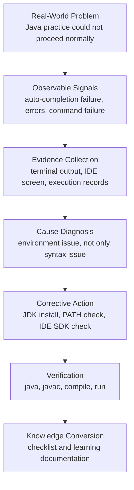

# Problem-Solving Ontology

This document summarizes my real-world problem-solving process based on a Java learning environment issue.

The main point is not the incident itself, but how I identified the problem, collected evidence, diagnosed the cause, corrected the environment, and turned the experience into reusable knowledge.

---

## 1. Problem Context

During Java class practice, the main obstacle was not the Java code itself.

The actual issue appeared before coding could proceed properly: the development environment was not correctly configured.

At first, the situation could have looked like a learning or practice problem. However, the real cause was related to the Java execution environment.

```text
Java code needed to be written
-> IDE and terminal did not recognize Java properly
-> auto-completion, compilation, and execution did not work reliably
-> class practice flow was repeatedly blocked
```

---

## 2. Observable Signals

I separated the problem into observable signals instead of relying only on feelings.

```text
basic Java auto-completion did not work correctly
System-related code showed errors
java or javac commands were not recognized in the terminal
new Java files did not behave as expected
```

These signals suggested that the computer was not properly recognizing the Java development environment.

---

## 3. Evidence Collection

To solve the problem, I focused on verifiable evidence.

The evidence included:

```text
terminal command results
IDE error indicators
failed Java auto-completion
java / javac command recognition failure
screen records with date and time
```

I used AI Codex to help diagnose the environment and narrow the problem from a syntax issue to a system configuration issue.

---

## 4. Cause Diagnosis

Based on the evidence, I separated the visible symptom from the actual cause.

```text
Visible symptom:
Java practice and execution did not proceed normally

Possible misunderstanding:
weak syntax knowledge
lack of review
unfamiliarity with IDE usage

Actual cause:
Java execution environment or PATH configuration was not properly set
```

The important point was that the external symptom and the real cause were different.

The situation looked like a practice problem, but it was actually a development environment problem.

---

## 5. Corrective Actions

After identifying the cause, I broke the solution into executable steps.

```text
check Java 21 installation
install or reinstall JDK
check PATH environment variable
verify java command
verify javac command
check IDE Java SDK configuration
compile and run a simple Java file
```

Through this process, the Java development environment was restored and Java code could be compiled and executed correctly.

---

## 6. Feedback Verification

I verified the result through execution, not assumption.

```text
java -version worked
javac -version worked
Java file compilation succeeded
main method execution succeeded
IDE errors were reduced or removed
class practice flow became possible again
```

This stage confirmed that the issue was actually resolved.

---

## 7. Knowledge Conversion

I converted the experience into reusable knowledge.

```text
Not every coding problem is a syntax problem.
Execution environment, PATH, JDK, and IDE settings directly affect learning.
Problem-solving should begin with observable evidence.
AI tools are useful for narrowing diagnosis quickly.
After solving an issue, documentation prevents repeated confusion.
```

---

## 8. Problem-Solving Ontology



---

## 9. Personal Problem-Solving Capability

This experience demonstrates the following capabilities:

```text
1. I did not assume the cause too early.
2. I collected evidence through visible errors and command results.
3. I used AI tools to narrow the diagnosis.
4. I identified the actual cause as an environment issue.
5. I restored the Java 21 development environment.
6. I documented the process as reusable knowledge.
```

In one sentence:

> I solve real-world technical problems by turning confusing situations into observable signals, evidence, root-cause diagnosis, corrective action, and reusable knowledge.
